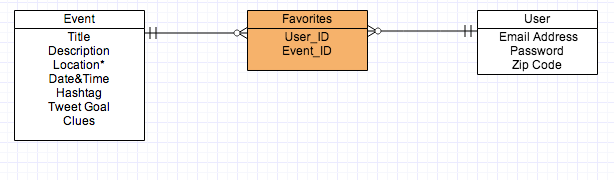

# Twitter Maps

### GA WDI DC April 2014, Project 1

### Overview

**Twitter_maps** is recreational web application designed to generate buzz for any special event by incrementally revealing its location on a map based on the amount of times a specified hashtag was tweeted. It was developed as a sample Rails project for the April 2014 Web Development Immersive course at General Assembly. It was developed over a 5 day sprint to model the agile software development process.

[Visit Twitter Maps]()

### Technologies Used

* Ruby 2.1.1
* Ruby on Rails 4.1.1
* PostgreSQL Database
* Authentication & Authorization using [Devise](https://github.com/plataformatec/devise) and [OmniAuth](https://github.com/intridea/omniauth)
* Twitter integration using the [Twitter REST API](https://dev.twitter.com/docs/api/1.1)
* Testing using using [rspec-rails](https://github.com/rspec/rspec-rails), [capybara](https://github.com/jnicklas/capybara), [shoulda-matchers](https://github.com/thoughtbot/shoulda-matchers) and [factory_girl_rails](https://github.com/thoughtbot/factory_girl_rails)
* CSS styling using [Bootstrap](http://getbootstrap.com/)

### User Stories Completed

* As a user I can see a list of all events in my area
* As a user I can log in
* As a user I can connect to and log in with Twitter
* As a user I can see an event map
* As a user I can see an event on the map near a specified zip code
* As a user I can see a hashtag associated with an event
* As a user I can see a twitter feed of a hashtag on an event page
* As a user I can subscribe to an event when logged in

### Backlog

A full list of user stories can be found by looking at [this Pivotal Tracker Project](https://www.pivotaltracker.com/s/projects/1102542)

### ERD

*Within database, event location is stored as 1) zip code, 2) latitude & longitude, and 3) physical address

---
###### Written by Mikael Davis
